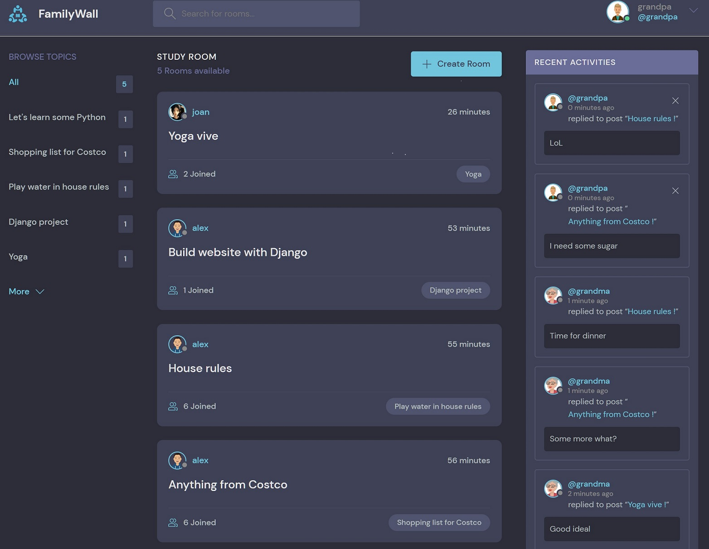
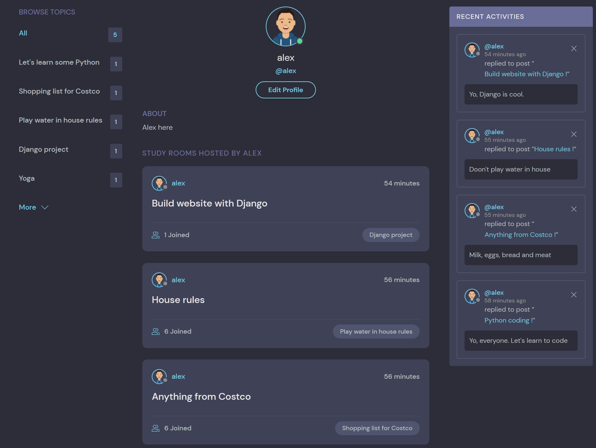
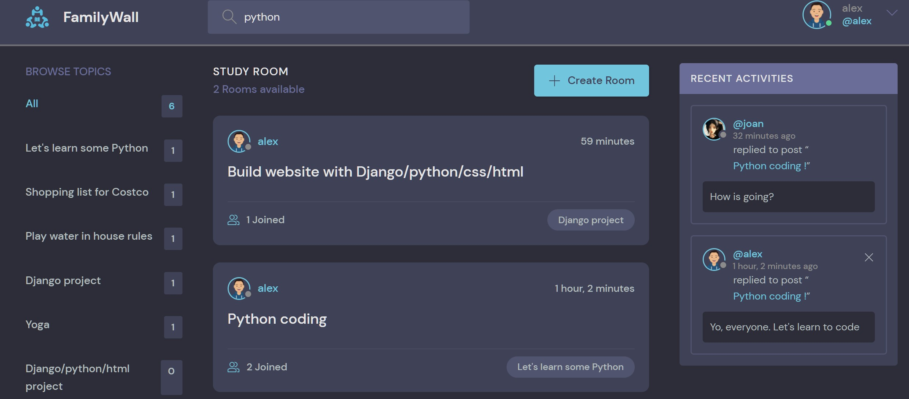

A discord like social app that I followed in an online course. 
Trying to tweak it to be a family study/discussion board (family wall).

# Features
* Users can register and login/logout
* Create a study room to start discussion of a topic
* Join a discussion by sending messages. New messages will be displayed in 'Recent Activities'
* User profile shows everything belongs to user
* Search by keywords

# Study rooms Page
  

# User Profile Page

# Search by keywords

